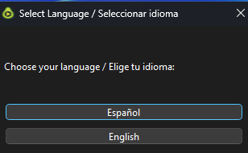
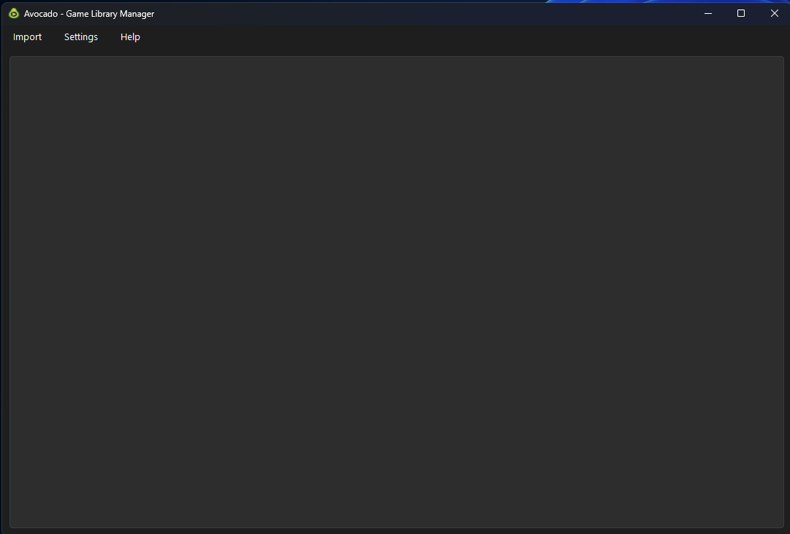
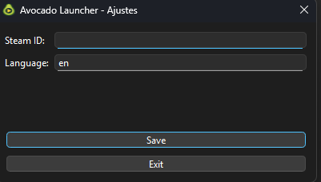
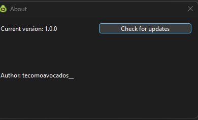

# :video_game: :avocado: Avocado Game Launcher

**Avocado Game Launcher** is a **desktop application** that lets you **organize and launch all your games from one place**. It **automatically loads your game libraries from Steam and Epic Games**, and also allows you to **add local games manually**.

---

## :memo: Planned Features
- User library of games/software.  
- Add games with executable and cover image.  
- Launch games directly from the app.  
- Save configuration and library data (JSON/SQLite).  
- Cross-platform interface: Windows, Linux, and Mac.  

---
## :camera_flash: Screenshots

---

## 🚀 Current Status
- Main window created with **menu bar** (Import / Help).  
- **Import → Local Game**: lets you add local executables; cover art is fetched from **RAWG API**.  
- Games are saved persistently (JSON), avoiding duplicates.  
- Each game in the list shows:  
  - Cover image  
  - Game name  
  - **Launch button** (runs the executable)  
  - **Delete button** (removes the game from the library).  
- **Help → About** dialog with app info and translations (EN/ES).  

## Download

Get the latest version here: [Avocado Game Launcher Latest Release](https://github.com/tecomoavocados-dev/avocado_game_launcher/releases/latest)